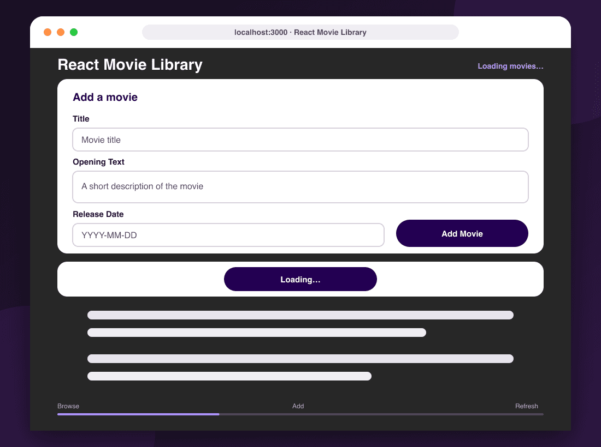

# React Movie Library

[](https://github.com/fatmakahveci/react-ts-movie/actions/workflows/test.yml)
[](https://github.com/fatmakahveci/react-ts-movie/releases)
[](https://github.com/users/fatmakahveci/packages/container/package/react-ts-movie)
[](https://nextjs.org/)
[](https://www.typescriptlang.org/)
[](LICENSE.md)

A responsive Next.js and TypeScript application for browsing and adding movie records backed by Firebase Realtime Database.

## Demo



The walkthrough uses fictional data to illustrate the core fetch, add, and refresh flow without writing to a live database.

## Features

- Fetches and normalizes movie records from Firebase Realtime Database
- Adds validated movie records and refreshes the collection automatically
- Provides loading, empty, success, configuration, and request-error states
- Uses accessible form controls, status announcements, and keyboard focus styles
- Adapts the movie grid and form layout across desktop and mobile screens
- Keeps Firebase configuration outside the source tree

## Technology

- Next.js App Router
- React
- TypeScript in strict mode
- Firebase Realtime Database REST API
- Node.js test runner with TypeScript support
- GitHub Actions and GitHub Container Registry

## Getting Started

### Prerequisites

- Node.js 22 or newer
- npm
- A Firebase Realtime Database with read and write rules appropriate for your environment

### Installation

```bash
git clone https://github.com/fatmakahveci/react-ts-movie.git
cd react-ts-movie
npm install
cp .env.example .env.local
```

Set the database URL in `.env.local`:

```dotenv
NEXT_PUBLIC_FIREBASE_DATABASE_URL=https://your-project-default-rtdb.firebaseio.com
```

Start the development server:

```bash
npm run dev
```

Open [http://localhost:3000](http://localhost:3000).

## Configuration

| Variable | Required | Description |
| --- | --- | --- |
| `NEXT_PUBLIC_FIREBASE_DATABASE_URL` | Yes | Base URL of the Firebase Realtime Database, without `/movies.json` |

Because this variable is exposed to the browser, database access must be protected with Firebase Security Rules. Never place service-account credentials or private tokens in `NEXT_PUBLIC_*` variables.

Movie records are stored under the `/movies` collection with this shape:

```json
{
  "title": "Arrival",
  "openingText": "A linguist attempts to communicate with visitors from beyond Earth.",
  "releaseDate": "2016-11-11"
}
```

## Quality Checks

```bash
npm run lint
npm test
npm run build
```

Run the complete local verification pipeline with:

```bash
npm run check
```

## Project Structure

```text
src/
├── app/
│   ├── components/        Movie form, collection, and card UI
│   ├── globals.css        Application theme and responsive layout
│   ├── layout.tsx         Document metadata and root layout
│   └── page.tsx           Page state and request orchestration
├── lib/
│   ├── movie-validation.ts
│   └── movies-api.ts      Firebase REST boundary and response parsing
└── shared/
    └── types.ts           Shared domain and component contracts
```

## Security

- Copy `.env.example` to `.env.local`; local environment files are ignored by Git.
- Treat the public Firebase URL as an identifier, not a secret.
- Enforce authorization and schema validation through Firebase Security Rules.
- Report vulnerabilities according to the [security policy](.github/SECURITY.md).

## Contributing

Contributions are welcome. Read the [contributing guide](.github/CONTRIBUTING.md) before opening a pull request.

## Project Resources

- [Releases](https://github.com/fatmakahveci/react-ts-movie/releases)
- [Changelog](CHANGELOG.md)
- [Security policy](.github/SECURITY.md)
- [License](LICENSE.md)
